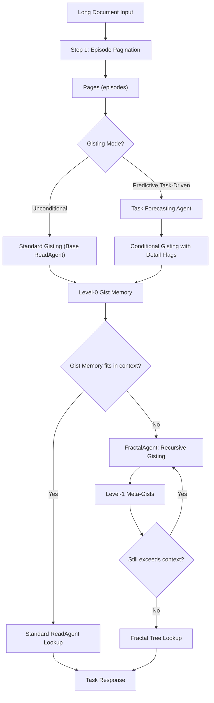

# Implementation Plan: ReadAgent + FractalAgent & Predictive Task-Driven Gisting

## Background & Key Architectural Decision

### Do we need to implement the base paper (ReadAgent) first?

**Yes — the base ReadAgent IS the foundation.** Your two improvements (FractalAgent and Predictive Task-Driven Gisting) are *extensions* of the ReadAgent pipeline, not replacements. Here's why:

| Component | ReadAgent (Base) | FractalAgent | Predictive Gisting |
|---|---|---|---|
| Episode Pagination | ✅ Required | Reuses base pagination | Reuses base pagination |
| Memory Gisting | ✅ Required | Applies gisting recursively to gists | Replaces unconditional gisting with task-aware gisting |
| Interactive Lookup | ✅ Required | Extends to multi-level tree traversal | Reuses base lookup |
| LLM Prompting | ✅ Required | Adds new prompts for tree navigation | Adds task-forecasting prompts |

> [!IMPORTANT]
> **The improved implementation inherently includes the base paper's architecture.** We will build a unified codebase where the base ReadAgent pipeline is the core, and FractalAgent + Predictive Gisting are modular extensions on top of it. You don't need to implement them separately — it's one integrated system.

---

## Architecture Overview



---

## Proposed Changes

### Component 1: Core ReadAgent Pipeline (Base Paper)

This is the foundational layer. All improvements build on top of this.

#### [NEW] `readagent/config.py`
- API key configuration, model selection (OpenAI GPT-4o / GPT-3.5 for cost efficiency)
- Pagination hyperparameters (`min_words`, `max_words`)
- Lookup strategy settings (parallel vs sequential, max lookups)

#### [NEW] `readagent/pagination.py`
- **Episode Pagination**: Splits document into variable-length pages using LLM-guided break points
- Inserts numbered tags between paragraphs
- LLM chooses natural pause points (scene transitions, dialogue ends, etc.)
- Enforces `min_words` / `max_words` constraints
- Returns ordered list of `Page` objects with metadata

#### [NEW] `readagent/gisting.py`
- **Memory Gisting**: Compresses each page into a short gist using LLM
- Uses "shorten" (not "summarize") to preserve narrative flow
- Prepends page tags (e.g., `⟨Page 2⟩`) for contextualization
- Concatenates all gists into the gist memory
- Tracks compression rates

#### [NEW] `readagent/lookup.py`
- **ReadAgent-P (Parallel Lookup)**: Selects multiple pages at once given gist memory + task
- **ReadAgent-S (Sequential Lookup)**: Selects one page at a time, iteratively
- Replaces gist(s) at corresponding positions with raw pages
- Final response generation with expanded memory

#### [NEW] `readagent/utils.py`
- Word counting, text splitting by paragraphs
- Compression rate calculation: `CR = 100 * (1 - in_context_words / full_context_words)`
- Prompt template loading and formatting

#### [NEW] `readagent/prompts/`
- `pagination.txt` — Pagination prompt template
- `gisting.txt` — Standard gisting prompt template  
- `parallel_lookup.txt` — Parallel lookup prompt template
- `sequential_lookup.txt` — Sequential lookup prompt template
- `response_mcq.txt` — Response prompt for multiple-choice
- `response_freeform.txt` — Response prompt for free-form answers

---

### Component 2: FractalAgent — Recursive Gisting for Higher Context Scaling

This addresses the limitation where concatenated gist memory exceeds the model's context window.

#### [NEW] `readagent/fractal_agent.py`
- **Recursive Gisting**: When Level-0 gists exceed context window, creates Level-1 "meta-gists" (gists of gists)
- Continues recursively until the top-level fits in context
- Builds a **fractal tree** data structure:
  ```
  Level-2 Meta-Gists (fits in context)
      ├── Level-1 Meta-Gist A → [Gist 1, Gist 2, ..., Gist k]
      ├── Level-1 Meta-Gist B → [Gist k+1, ..., Gist 2k]
      └── ...
  ```
- **Tree Navigation Lookup**: During interactive lookup, the agent navigates from top-level down to identify which branch contains relevant information, then expands that branch
- Configurable grouping size (how many gists to combine at each level)

#### [NEW] `readagent/prompts/fractal_gisting.txt`
- Prompt for creating meta-gists from groups of gists

#### [NEW] `readagent/prompts/fractal_lookup.txt`
- Prompt for navigating the fractal tree to find relevant branches

---

### Component 3: Predictive Task-Driven Gisting

This addresses hallucination risks from unconditional gisting by predicting likely tasks.

#### [NEW] `readagent/predictive_gisting.py`
- **Task Forecasting Agent**: Before gisting, analyzes the document type/genre and generates hypothesized tasks (e.g., "Who is the main character?", "What was the outcome of the meeting?")
- **Conditional Compression**: Uses predicted tasks to determine which sections need verbatim detail preservation vs. aggressive compression
- **Detail Flagging**: Marks sections with importance scores:
  - `HIGH` — Preserve near-verbatim (key facts, names, numbers, dialogue)
  - `MEDIUM` — Standard gisting
  - `LOW` — Aggressive compression
- Falls back to standard gisting for sections with no predicted relevance

#### [NEW] `readagent/prompts/task_forecast.txt`
- Prompt for generating hypothesized tasks based on document content

#### [NEW] `readagent/prompts/conditional_gisting.txt`
- Prompt for task-aware gisting with importance flags

---

### Component 4: Evaluation & Demo

#### [NEW] `readagent/evaluation.py`
- ROUGE score calculation (ROUGE-1, ROUGE-2, ROUGE-L)
- LLM Rater implementation (Strict and Permissive) as described in the base paper
- Compression rate tracking
- Comparison framework between base ReadAgent, FractalAgent, and Predictive Gisting

#### [NEW] `main.py`
- CLI entry point to run the full pipeline
- Supports flags:
  - `--mode base` (standard ReadAgent)
  - `--mode fractal` (with FractalAgent)
  - `--mode predictive` (with Predictive Task-Driven Gisting)
  - `--mode full` (both improvements active)
- Input: document file + questions
- Output: answers, compression rates, gist memory visualization

#### [NEW] `demo.py`
- Interactive demo that processes a sample document
- Shows step-by-step pipeline visualization
- Compares base vs improved outputs

#### [NEW] `requirements.txt`
- `openai`, `rouge-score`, `tiktoken`, `rich` (for CLI output)

---

## Open Questions

> [!IMPORTANT]
> **1. LLM API Choice**: Which LLM API do you want to use? Options:
> - **OpenAI (GPT-4o / GPT-4o-mini)** — Most accessible, good performance
> - **Google Gemini API** — Closer to the original paper (which used PaLM 2-L)
> - **Local model (Ollama/llama.cpp)** — Free but slower
> 
> This affects API key setup and cost. The base paper used PaLM 2-L (8K context), but any modern LLM works.

> [!IMPORTANT]
> **2. Evaluation Dataset**: Do you want to evaluate on one of the paper's datasets (QuALITY, NarrativeQA, QMSum), or just demonstrate the system on custom documents? The full benchmark evaluation requires downloading datasets and significant API costs.

> [!WARNING]
> **3. Scope Confirmation**: You mentioned implementing only FractalAgent and Predictive Task-Driven Gisting (not WatchAgent or Differentiable Gist Retrieval). Is this correct? The plan above covers only these two improvements.

> [!NOTE]
> **4. Paper Section**: Will you need help writing the methodology/results sections of your paper after implementation, or is this purely about the code?

---

## Verification Plan

### Automated Tests
1. **Unit tests** for pagination (correct page boundaries, word count constraints)
2. **Unit tests** for gisting (compression rate within expected range)
3. **Integration test**: End-to-end pipeline on a sample document
4. **FractalAgent test**: Verify recursive gisting triggers correctly when gists exceed context
5. **Predictive Gisting test**: Verify task forecasting produces reasonable hypothesized tasks

### Manual Verification
1. Run on a sample long document (e.g., a Project Gutenberg book chapter) and inspect:
   - Pagination quality (natural break points)
   - Gist quality (readable, preserves key info)
   - Lookup decisions (selects relevant pages)
   - Final answer quality
2. Compare base ReadAgent vs FractalAgent vs Predictive Gisting outputs side-by-side
3. Verify FractalAgent can handle documents whose gists exceed context (simulate with small context limit)

### Metrics to Report
- Compression Rate (CR) at each level
- Number of lookups used
- Answer quality (manual inspection or LLM rater)
- Token usage comparison between modes
